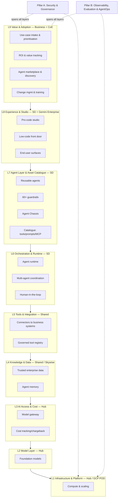
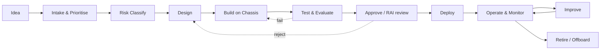
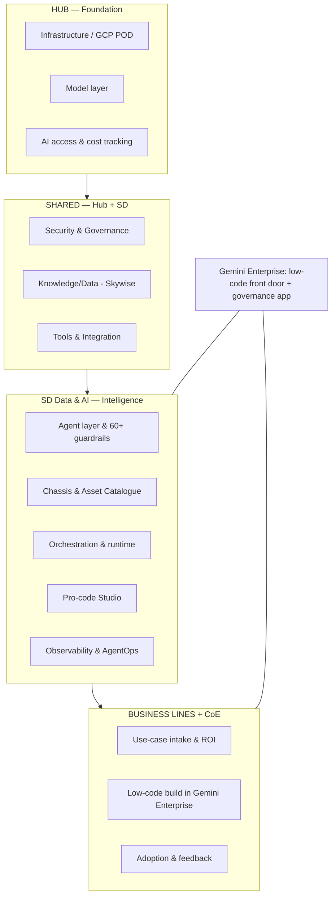
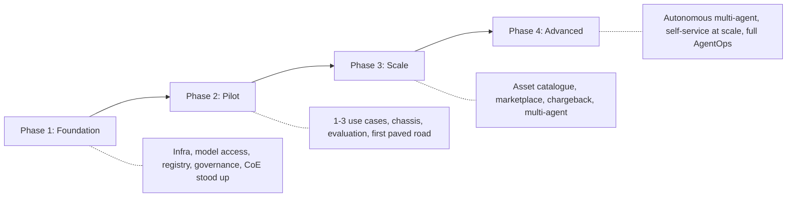

# Airbus Agentic AI Studio (AAS): A Functional Blueprint for Management

## Executive Summary (One Page)

Airbus should build the Agentic AI Studio (AAS) as a **governed "factory" for custom AI agents** — a set of standardised, reusable building blocks and "paved roads" that let business lines go from idea to a production, policy-compliant agent in days rather than months. The single most important design decision is this: **AAS must be governance-first, reuse-first, and complementary to Gemini Enterprise**, not a competing build tool. Gemini Enterprise is the low-code/no-code "front door" for business users; AAS is the pro-code "engine room" for complex, high-value, tightly governed agents — and both must be registered and governed through one shared control plane.

This matters because the market evidence is stark. Deloitte's 2026 Tech Trends report finds only 11% of organisations have agents in production despite 38% piloting them [deloitte](https://www.deloitte.com/us/en/insights/topics/technology-management/tech-trends.html) (an ~89% gap), and IDC separately reports that "88% of AI agent POCs never graduate to production deployment [anarsolutions](https://anarsolutions.com/why-agentic-ai-pilots-fail-production/) — for every 33 pilots a company launches, only 4 make it out alive." [anarsolutions](https://anarsolutions.com/why-agentic-ai-pilots-fail-production/) Gartner (press release, 25 June 2025, analyst Anushree Verma) predicts "over 40% of agentic AI projects will be canceled by the end of 2027, due to escalating costs, unclear business value or inadequate risk controls." [gartner](https://www.gartner.com/en/newsroom/press-releases/2025-06-25-gartner-predicts-over-40-percent-of-agentic-ai-projects-will-be-canceled-by-end-of-2027) The failures are overwhelmingly **organisational, not technical** — no ownership, no ROI tracking, weak governance, and "agent sprawl." AAS is Airbus's structural answer to those failure modes.

We organise everything required into **9 functional layers** (foundation → business value) plus **2 cross-cutting pillars** and **1 operating-model element**, mapped to the existing Airbus 7-layer reference:

1. **L1 Infrastructure & Platform** — the compute foundation (Hub / GCP POD)
2. **L2 Model Layer** — the "brains" the agents think with (Hub)
3. **L3 AI Access & Cost Layer** — the metered, secure doorway to models (Hub)
4. **L4 Knowledge & Data Layer** — trusted enterprise data and memory (Shared / Skywise)
5. **L5 Tools & Integration Layer** — the agent's "hands" into business systems (Shared)
6. **L6 Orchestration & Runtime Layer** — where agents actually run and coordinate (SD)
7. **L7 Agent Layer & Asset Catalogue** — reusable agents, guardrails, the "Chassis" (SD)
8. **L8 Experience & Studio Layer** — the front doors for builders and users (SD + Gemini Enterprise)
9. **L9 Value & Adoption Layer** — intake, ROI, marketplace, change management (Business + CoE)
- **Pillar A: Security & Governance** (Shared Hub/SD) — runs top-to-bottom
- **Pillar B: Observability, Evaluation & AgentOps** (SD) — runs top-to-bottom
- **Operating Model: People, Roles & Center of Excellence** — who runs the factory

The four non-functional goals map cleanly: **L1–L3 primarily deliver Scalable & Stable; L4–L7 deliver Capable; L8–L9 deliver business value/adoption; and the two pillars deliver Secure & Governed** across all layers.

**Top recommendation:** Sequence the build governance-first in four phases (Foundation → Pilot → Scale → Advanced), stand up the Center of Excellence and the agent registry before onboarding the second use case, and refuse to onboard any agent without a named owner, a risk classification, and a defined retirement trigger.

---

## Key Findings

- **The production gap is the core business problem, and it is organisational.** Deloitte 2026 puts production at ~11% [deloitte](https://www.deloitte.com/us/en/insights/topics/technology-management/tech-trends.html) (an ~89% gap); IDC reports 88% of agent POCs never reach production; [anarsolutions](https://anarsolutions.com/why-agentic-ai-pilots-fail-production/) Gartner projects 40%+ of agentic projects cancelled by 2027. The named reasons — escalating costs, unclear business value, inadequate risk controls — are all things a well-designed platform layer fixes.
- **Every serious vendor has converged on the same functional shape.** Google (Gemini Enterprise Agent Platform), AWS (Bedrock AgentCore), Microsoft (Copilot Studio + Foundry), Salesforce (Agentforce), ServiceNow, and IBM (watsonx Orchestrate) all ship the same building blocks: a model layer, a governed access gateway, memory/knowledge, tools/integration, a runtime, an agent registry/identity, a catalogue of reusable assets, observability/evaluation, and lifecycle governance. This convergence tells us the layer model below is not speculative — it is the emerging industry standard.
- **Governance is a scale enabler, not a brake.** Microsoft's own maturity guidance states verbatim: "Governance enables faster adoption rather than slowing it down." [microsoft](https://learn.microsoft.com/en-us/microsoft-copilot-studio/guidance/maturity-model-security-governance) The ~11% who reach production do so because they instrument, own, and govern — not because they have better models.
- **Reuse is where the ROI compounds.** An Asset Catalogue of agents, tools, prompts and MCP servers (Model Context Protocol = a standard way for agents to discover and use tools) is what turns one-off wins into an enterprise capability. Vendors describe internal marketplaces (Google's Agent Garden, IBM's Agent Catalog, QuantumBlack/McKinsey's "Brix") as central to scaling.
- **"Agent sprawl" is the emerging board-level risk.** Uncontrolled, unregistered agents with excessive permissions expand the attack surface and defeat auditability. A central registry with per-agent identity and named ownership is the antidote — and must exist before scaling.
- **The strategic tailwind is real.** Gartner predicts "by 2026, 80% of large software engineering organizations will establish platform engineering teams as internal providers of reusable services, components and tools for application delivery — up from 45% in 2022," [gartner](https://www.gartner.com/en/infrastructure-and-it-operations-leaders/topics/platform-engineering) and frames a future of small teams enabled by AI-native platforms. AAS is Airbus's expression of exactly this pattern.

---

## Details: The Functional Layers

### Whole-Platform Layer Diagram

---

### L1 — Infrastructure & Platform Layer
- **What it is (plain words):** The computing foundation — the servers, networking and scaling machinery agents run on.
- **Why business should care:** If this is weak, agents are slow, unreliable, or fall over under load; if it's strong, the platform scales quietly in the background.
- **Key functional capabilities:** Elastic compute that scales with demand; secure isolation so one team's agent can't affect another's; environment separation (test vs. production); disaster recovery and high availability; network controls; foundation for data residency/sovereignty.
- **Owner:** Hub (GCP POD).
- **Goal served:** Scalable & Stable.
- *Examples note: GCP POD; AWS Bedrock AgentCore describes per-session isolation in dedicated micro-environments.*

### L2 — Model Layer
- **What it is:** The "brains" — the large AI models that let agents understand language and reason.
- **Why business should care:** Model choice drives quality, cost and risk; being able to switch or mix models protects Airbus from lock-in and lets each use case pick the right brain.
- **Key functional capabilities:** A curated menu of approved models; model-agnostic design (swap models without rebuilding agents); ability to tune/customise where justified; a model "garden" for discovery; safety/quality vetting of models before approval; version control of models.
- **Owner:** Hub.
- **Goal served:** Capable (with cost implications).
- *Examples note: Gemini and Claude; vendors offer 200+ model gardens.*

### L3 — AI Access & Cost Layer
- **What it is:** The single, secure, metered doorway between agents and the models.
- **Why business should care:** This is where Airbus controls spend and prevents runaway costs — the #1 cited reason agent projects get cancelled.
- **Key functional capabilities:** A model gateway all traffic passes through; per-agent and per-business-line cost tracking; chargeback/showback so costs land with the team that owns the agent; rate limits and budget caps; caching to cut cost; usage quotas; content safety screening of prompts and responses at the doorway.
- **Owner:** Hub (base capability).
- **Goal served:** Scalable & Secure/Governed (cost control).
- *Examples note: Gemini Enterprise cost tracking; model-gateway pattern common to AWS, Salesforce ("centralized LLM governance").*

### L4 — Knowledge & Data Layer
- **What it is:** The trusted enterprise information agents draw on, plus their "memory" of past interactions.
- **Why business should care:** Agents are only as good as the data they see; bad or stale data makes agents confidently wrong. This layer is what makes answers accurate and grounded.
- **Key functional capabilities:** Secure connection to enterprise data (grounding, so answers are based on real Airbus data); retrieval of relevant documents; short- and long-term agent memory; data-quality and freshness controls; data classification and access respecting existing permissions; data lineage for audit.
- **Owner:** Shared (Skywise for data; SD for agent memory patterns).
- **Goal served:** Capable & Secure/Governed.
- *Examples note: Skywise; vendor "RAG engines," memory banks, and vector search.*

### L5 — Tools & Integration Layer
- **What it is:** The agent's "hands" — the connectors that let agents actually do things in business systems (look up an order, update a record, trigger a workflow).
- **Why business should care:** An agent that can only talk is a chatbot; an agent that can act delivers real work. But action is also where the risk is — so tools must be governed.
- **Key functional capabilities:** A governed catalogue of approved tools/connectors; standard tool protocol (MCP) so tools are reusable across agents; tool discovery scoped by permission (agents see only tools they're allowed); [truefoundry](https://www.truefoundry.com/blog/mcp-tool-discovery-for-enterprise-ai-agents) safe execution sandboxes; per-tool approval and boundaries; human confirmation gates for high-impact actions (e.g. writes, transactions).
- **Owner:** Shared (SD builds/curates; business systems owned by their owners).
- **Goal served:** Capable & Secure/Governed.
- *Examples note: MCP tool catalogues; AgentCore Gateway wraps existing APIs; ServiceNow Agent Fabric.*

### L6 — Orchestration & Runtime Layer
- **What it is:** Where agents actually run, hold state, and coordinate with each other and with humans.
- **Why business should care:** This is the difference between a demo and a dependable service that runs long tasks, recovers from failures, and knows when to ask a human.
- **Key functional capabilities:** Reliable agent runtime (including long-running tasks); multi-agent coordination (an "orchestrator" that routes work to the right specialist agent); human-in-the-loop checkpoints and escalation paths; deterministic + AI reasoning mix for predictable workflows; retries, fallbacks and resilience; state/session management.
- **Owner:** SD.
- **Goal served:** Stable & Capable.
- *Examples note: AgentCore Runtime supports long-running workloads; ServiceNow AI Agent Orchestrator; IBM Agentic Workflows.*

### L7 — Agent Layer & Asset Catalogue
- **What it is:** The heart of AAS — the reusable agents themselves, the guardrails around them, the auto-scaffolding "Chassis," and the shared catalogue of reusable parts.
- **Why business should care:** This is where reuse compounds into ROI and where Airbus-specific safety lives. It turns "weeks to days" for builders and stops teams reinventing the wheel.
- **Key functional capabilities:** Library of reusable agents and blueprints/templates; Airbus's 60+ custom guardrails (policy rules that constrain agent behaviour); the Agent Chassis (auto-scaffolding so developers focus on business logic); Asset Catalogue of agents, tools, prompts and MCP servers; versioning of agents and prompts; agent registry with unique identity per agent; packaging so agents are portable.
- **Owner:** SD.
- **Goal served:** Capable & Secure/Governed.
- *Examples note: Google Agent Garden / IBM Agent Catalog; QuantumBlack (AI by McKinsey) runs an internal reusable-asset marketplace called "Brix" of independently deployable [mckinsey](https://www.mckinsey.com/capabilities/quantumblack/labs/our-products) AI components.* [medium](https://medium.com/quantumblack/how-mcp-can-accelerate-ai-reusability-1d40e876d48a)

### L8 — Experience & Studio Layer
- **What it is:** The front doors — a pro-code studio for engineers and the low-code front door for business users — plus the surfaces where employees actually use agents.
- **Why business should care:** This determines who can build and how fast; a two-door approach lets Airbus serve both expert developers and citizen builders without chaos.
- **Key functional capabilities:** Pro-code studio (design → build → test → package → deploy); low-code/no-code door (Gemini Enterprise) for simpler agents; guided 10-step generation workflow (requirements → asset search → design → build → blueprint → setup → templating → optimisation → deployment → packaging); test/preview sandbox; delivery of agents into everyday tools (chat, Workspace/Teams); self-service "paved road" experience.
- **Owner:** SD (pro-code studio) + Gemini Enterprise (low-code door).
- **Goal served:** Capable (developer velocity) & Scalable (self-service).
- *Examples note: Vertex/Gemini Agent Studio + ADK; Copilot Studio as "front door," Foundry for custom brains.*

### L9 — Value & Adoption Layer
- **What it is:** The business machinery that decides what to build, proves it was worth it, helps people adopt it, and lets others find and reuse it.
- **Why business should care:** This is the layer that most enterprises skip — and it is precisely why most pilots die. It is where money is made or lost.
- **Key functional capabilities:** Use-case intake and prioritisation (a front door for ideas, scored on value and risk); business-case and ROI/value tracking per agent; an agent marketplace/discovery so business lines find existing agents before building new ones; change management, training and enablement; a support model (who to call when an agent misbehaves); user feedback loops; adoption metrics.
- **Owner:** Business lines + Center of Excellence.
- **Goal served:** Business value & Adoption (underpins all four goals).
- *Examples note: vendor agent marketplaces; ROI metrics like Gartner's Agent Cost Per Completed Task (ACCT) and Agent Value Multiple (AVM).* [automationanywhere](https://www.automationanywhere.com/company/blog/agentic-ai-roi)

---

### Cross-Cutting Pillar A — Security & Governance
- **What it is:** The trust and control system that runs through every layer, from infrastructure to business value.
- **Why business should care:** In aerospace, trust and compliance outweigh features. This pillar is what lets Airbus scale agents safely and satisfy regulators.
- **Key functional capabilities:** Per-agent identity (every agent is a distinct, trackable actor, not a borrowed human login); [truefoundry](https://www.truefoundry.com/blog/ai-agent-identity) central agent registry with named owner and business purpose for every agent; [trussed](https://trussed.ai/resources/non-human-identity-governance-for-autonomous-ai-agents) least-privilege access and credential lifecycle (issue, rotate, revoke); [trussed](https://trussed.ai/resources/non-human-identity-governance-for-autonomous-ai-agents) runtime policy enforcement (block high-risk actions before they happen); the 60+ guardrails; responsible-AI review board and risk classification (minimal/limited/high-risk tiers); audit & compliance evidence aligned to EU AI Act and ISO/IEC 42001; human-oversight requirements for high-risk agents; agent retirement/offboarding.
- **Owner:** Shared (Hub + SD).
- **Goal served:** Secure & Governed (primary), enabling Scale.
- *Examples note: Google Agent Identity + Agent Registry + Agent Gateway; [google](https://docs.cloud.google.com/gemini-enterprise-agent-platform/govern/agent-identity-overview) Microsoft Entra Agent ID; ISO 42001 clause 8.4 requires an AI-system inventory.* [eccouncil](https://www.eccouncil.org/cybersecurity-exchange/responsible-ai-governance/eu-ai-act-nist-ai-rmf-and-iso-iec-42001-a-plain-english-comparison/)

### Cross-Cutting Pillar B — Observability, Evaluation & AgentOps
- **What it is:** The "flight recorder" and quality lab for agents — seeing what agents do, measuring whether they're good, and catching problems.
- **Why business should care:** You cannot manage, cost, or trust what you cannot see. This pillar is what the successful ~11% have that the failed ~89% lack.
- **Key functional capabilities:** Tracing of agent reasoning, tool calls and hand-offs; live dashboards (success rate, latency, cost per run, steps per run); pre-deployment evaluation (quality score before an agent joins the catalogue); continuous evaluation and drift detection in production; alerting on cost/quality regressions; incident management and kill switches; feedback capture; version comparison / A-B testing.
- **Owner:** SD.
- **Goal served:** Stable & Secure/Governed.
- *Examples note: IBM watsonx Orchestrate uses an onboarding "staging area" that [ibm](https://www.ibm.com/new/announcements/revolutionizing-ai-agent-management-with-ibm-watsonx-orchestrate-new-observability-and-governance-capabilities) computes a quality score before an agent joins the catalog; observability commonly lags deployment — a large share of GenAI deployments run without dedicated observability [aimultiple](https://aimultiple.com/agentops) today.*

### Operating-Model Element — People, Roles & Center of Excellence
- **What it is:** The human organisation that runs the factory: the platform team, the Center of Excellence (CoE), and the community of practice.
- **Why business should care:** A platform is only as good as the people and operating model around it; the CoE is what turns scattered experiments into a coordinated, governed capability.
- **Key functional capabilities:** A platform/enablement team treating builders as customers ("paved roads"); a CoE owning standards, blueprints, and enablement; a responsible-AI/governance board with real decision rights; a community of practice for sharing patterns; role clarity (agent owner, business owner, data owner, identity lead); executive sponsorship and funding; a defined support and escalation model.
- **Owner:** Shared (SD platform team + Business + CoE).
- **Goal served:** All four (the connective tissue).

---

## Agent Lifecycle Journey (Idea → Retired)

Governance is embedded at every stage: risk classification before design, responsible-AI approval before deploy, monitoring during operate, and a deliberate retirement step so agents don't accumulate as "zombie" risk.

---

## Who Does What

**The key division of labour:** Hub provides the foundation (infrastructure, models, metered access). SD builds the intelligence (agents, guardrails, chassis, catalogue, runtime, studio, observability). Security/Governance, Data and Tools are shared. Business lines bring use cases, build simple agents in the low-code front door, and own adoption and ROI. Gemini Enterprise is the low-code door and the common governance/registration app — everything built in AAS is registered and governed alongside it.

---

## Phased Roadmap

- **Phase 1 – Foundation (governance-first):** Stand up infrastructure, model access with cost tracking, the agent registry + identity, the governance/responsible-AI board, and the CoE. No agent goes live without a named owner and risk class.
- **Phase 2 – Pilot:** Deliver 1–3 high-value, well-scoped use cases end-to-end; prove the Chassis and evaluation harness; establish the first "paved road."
- **Phase 3 – Scale:** Open the Asset Catalogue and marketplace; turn on chargeback; enable multi-agent orchestration and broader self-service.
- **Phase 4 – Advanced:** More autonomous multi-agent workflows, mature AgentOps, and self-service at scale for both pro-code and low-code builders.

---

## Summary Table

| Layer | What it does | Key capabilities | Owner | Goal served |
|---|---|---|---|---|
| L1 Infrastructure | Compute foundation agents run on | Elastic compute, isolation, environments, DR/HA | Hub | Scalable, Stable |
| L2 Model | The "brains" agents reason with | Approved model menu, model-agnostic, tuning, vetting | Hub | Capable |
| L3 AI Access & Cost | Secure metered doorway to models | Gateway, cost tracking, chargeback, budget caps, safety screen | Hub | Scalable, Secure |
| L4 Knowledge & Data | Trusted data + agent memory | Grounding, retrieval, memory, quality, lineage | Shared / Skywise | Capable, Secure |
| L5 Tools & Integration | Agent's "hands" into systems | Tool catalogue, MCP, scoped discovery, sandboxes, action gates | Shared | Capable, Secure |
| L6 Orchestration & Runtime | Where agents run & coordinate | Runtime, multi-agent, human-in-loop, resilience | SD | Stable, Capable |
| L7 Agent & Catalogue | Reusable agents, guardrails, Chassis | Blueprints, 60+ guardrails, Chassis, catalogue, versioning, registry | SD | Capable, Secure |
| L8 Experience & Studio | Front doors for builders/users | Pro-code studio, low-code door, 10-step workflow, sandbox | SD + Gemini Ent. | Capable, Scalable |
| L9 Value & Adoption | Decide, prove, adopt, reuse | Intake, ROI tracking, marketplace, change mgmt, support | Business + CoE | Business value |
| Pillar A Security & Governance | Trust & control across all layers | Identity, registry, least-privilege, risk tiers, audit (EU AI Act/ISO 42001), oversight, retirement | Shared | Secure & Governed |
| Pillar B Observability & AgentOps | See, measure, catch problems | Tracing, dashboards, pre-deploy eval, drift, alerts, kill switch | SD | Stable, Secure |
| Operating Model | People who run the factory | Platform team, CoE, RAI board, community, roles, sponsorship | Shared | All four |

---

## Top Functional Risks & Pitfalls Management Should Know

1. **Pilots never reach production ("pilot purgatory").** Deloitte 2026 finds only ~11% of organisations have agents in production; IDC reports 88% of agent POCs never reach production; Gartner predicts 40%+ of agentic projects cancelled by 2027. *Mitigation:* production-readiness and evaluation gates from Phase 1; fund for production, not demos.
2. **Uncontrolled agent sprawl / shadow agents.** Agents multiply faster than anyone can track, with excessive permissions and no owner — an active (not passive) security risk because agents act, not just store data. Gartner analyst Max Goss warned CIOs face "an ungoverned sprawl of agents that expose their organizations to a range of risks, including misinformation, oversharing, and data loss." [sap](https://news.sap.com/2026/08/agent-sprawl-why-ai-governance-is-now-board-level-issue/) *Mitigation:* central registry + per-agent identity + least-privilege before scaling.
3. **No ownership.** Agents with no accountable owner become "zombie" risk. *Mitigation:* no agent onboarded without a named business owner and a retirement trigger.
4. **Cost overruns.** Escalating cost is a top-three cancellation reason; token spend is easy to lose control of. *Mitigation:* model gateway, per-agent cost tracking, chargeback, budget caps; measure cost-per-completed-task (ACCT).
5. **Weak or bolted-on governance.** Governance treated as a one-time pre-launch checklist misses runtime risk, where an agent interprets instructions and acts against live data. *Mitigation:* governance-first phasing; runtime policy enforcement; treat governance as an enabler of scale.
6. **Unclear/undefined ROI.** "Unclear business value" is a top-three cancellation reason. *Mitigation:* every agent tied to a business KPI with a baseline before launch; kill underperformers early.
7. **Reinvention instead of reuse.** Without a catalogue/marketplace, every team rebuilds the same agent. *Mitigation:* Asset Catalogue + a mandatory "search before you build" intake step.
8. **Compliance exposure (EU AI Act / ISO 42001).** High-risk agents require risk management, technical documentation, human oversight, and registration; [omnithium](https://omnithium.ai/blog/ai-agent-compliance-soc2-iso-eu-ai-act.html) ISO 42001 certification alone does not satisfy the Act (it does not cover the Act's conformity assessment, Annex IV documentation, or EU database registration). [surecloud](https://www.surecloud.com/blog-hub/eu-ai-act-vs-iso-42001-whats-the-difference) *Mitigation:* risk-tiering at intake; audit-evidence capture by default; human oversight for high-risk tiers.
9. **"Agent washing" and over-automation.** Gartner estimates only about 130 of the thousands of [gartner](https://www.gartner.com/en/newsroom/press-releases/2025-06-25-gartner-predicts-over-40-percent-of-agentic-ai-projects-will-be-canceled-by-end-of-2027) "agentic AI" vendors are genuine; applying autonomous agents where simpler automation suffices inflates cost and risk. *Mitigation:* intake discipline — not every use case needs an agent.

---

## Recommendations

**Do first (Phase 1, next 90 days):**
- Stand up the **agent registry, per-agent identity, and governance/responsible-AI board before the second use case.** Make "named owner + risk class + retirement trigger" a hard gate.
- Establish the **Center of Excellence** with executive sponsorship and real decision rights over model choice, autonomy thresholds, and conflict resolution.
- Turn on **cost tracking at the model gateway** from day one — you cannot defend a cost you don't track.

**Do next (Pilot → Scale):**
- Deliver **1–3 high-value, low-to-medium-risk use cases** end-to-end to prove the Chassis and the evaluation harness; publish the first "paved road."
- Build the **Asset Catalogue and marketplace** and make "search before you build" a required intake step.
- Position AAS explicitly as **complementary to Gemini Enterprise**: low-code door for simple/citizen use; pro-code AAS for complex/high-governance use; one shared registry and governance app for both.

**Benchmarks / thresholds that change the plan:**
- If a pilot cannot show a **credible ROI within a 12-month window**, do not scale it.
- If **>10% of live agents lack a named owner or a monitoring dashboard**, freeze new onboarding and fix governance first.
- If a use case is **high-stakes (safety, legal, financial) or needs human empathy**, keep humans in control and delay autonomy.
- Track **cost-per-completed-task and task success rate** per agent monthly; cancel agents trending the wrong way before they consume budget.
- Only move to **Phase 4 (autonomous multi-agent)** once observability, evaluation gates, and kill switches are proven in Phase 3.

---

## Caveats

- **Failure-rate figures vary by source and are recent/fast-moving.** Reported pilot-to-production failure rates range from ~67% to ~89% across Deloitte, IDC, McKinsey, Gartner and others (2025–2026); they measure slightly different things (adoption vs. scaled-to-production vs. objectives-met). The direction is consistent even if the precise number is not; treat them as directional.
- **Vendor descriptions are partly marketing.** Capability lists from Google, AWS, Microsoft, Salesforce, ServiceNow and IBM are drawn from vendor and analyst material and describe intended/announced capabilities; some features are in preview. They are used here to validate the *functional shape*, not to endorse any product.
- **ROI figures are contested claims to validate locally.** The often-cited "171% average agentic AI ROI" (192% for US companies) originates from Deloitte's "State of Generative AI in the Enterprise" survey [pagerduty](https://www.pagerduty.com/resources/ai/learn/companies-expecting-agentic-ai-roi-2025/) and reflects *anticipated* returns; a 2026 McKinsey survey counterpoint reports most firms see no material earnings impact yet. [beam](https://beam.ai/agentic-insights/agentic-ai-roi-gap-2026) Validate against Airbus's own baselines, not assumed.
- **Some datapoints could not be independently pinned to a named primary source** (e.g., the precise share of GenAI deployments running "without observability," and the exact component count in McKinsey's "Brix"); these are presented directionally and softened accordingly.
- **Regulatory detail will evolve.** EU AI Act high-risk obligations and supporting standards (e.g. prEN 18286) have phased dates into 2027–2028 and are still being finalised; Airbus's legal/compliance function should confirm current obligations for each use case.
- **This is a functional, non-technical blueprint.** It deliberately avoids implementation architecture; the earlier 9-plane technical report remains the reference for engineering detail.